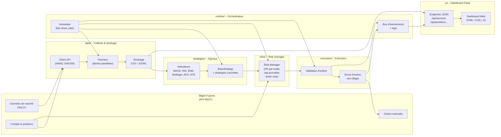

# Dossier de Projet RNCP 5 – Smart Trading Bot

> **Titre du projet :** Smart Trading Bot – Système de trading algorithmique automatisé pour crypto-monnaies  
> **Candidat :** MOLEINS Jules  
> **Titre visé :** Développeur Web et Web Mobile (DWWM – RNCP niveau 5)  
> **Établissement :** Holberton School, France  
> **Période de réalisation :** Février 2024 – Novembre 2025  
> **Date de rédaction :** Décembre 2025  

---

## Sommaire

1. Présentation générale du projet  
2. Compétences RNCP mises en œuvre  
3. Expression des besoins  
4. Environnement humain et technique  
5. Conception et architecture  
6. Réalisations front-end  
7. Réalisations back-end  
8. Tests, backtests et qualité  
9. Veille technologique et sécurité  
10. Bilan critique et perspectives  
11. Annexes (captures, extraits de code, résultats de backtest)

---

## 1. Présentation générale du projet

### 1.1. Contexte et positionnement

Ce projet a été développé dans le cadre de ma formation à **Holberton School** sur le programme **Full-Stack Software Engineering**. Ne disposant pas de stage en entreprise, j’ai choisi de créer un **projet de fin d’études complet**, jouant le rôle de « vitrine technique » pour le titre professionnel **DWWM – RNCP niveau 5**.

Le domaine choisi est celui du **trading algorithmique automatisé sur futures crypto (USDT-M)**, via l’API REST de la plateforme **Bitget**. Ce domaine est particulièrement adapté pour démontrer :

- La maîtrise de **développements back-end** (APIs, logique métier, gestion de données).  
- La réalisation d’un **front-end dynamique** consommant une API.  
- La mise en place d’un **risk management** strict (gestion du risque financier) et de bonnes pratiques de **sécurité informatique**.  

Le projet est entièrement individuel : de la conception à la réalisation, en passant par les tests, la documentation et l’interface de démonstration.

### 1.2. Motivations et enjeux

Plusieurs motivations ont guidé ce choix :

- **Défi technique :**
  - Intégration d’une API REST externe avec **authentification HMAC SHA256**.  
  - Traitement de **données financières temps réel** (chandeliers OHLCV).  
  - Architecture modulaire, event-driven, avec tâches planifiées.  
  - Gestion de l’état, persistance des données, journaux d’exécution.

- **Problématique métier réelle :**
  - Automatiser des décisions de trading basées sur des **stratégies techniques éprouvées**.  
  - Encadrer strictement le risque (2 % de capital max par trade, plafond journalier, limitation du levier).  
  - Fournir une traçabilité complète : logs, backtests, statistiques, dashboard.

- **Convergence de plusieurs blocs de compétences :**
  - **Bloc 1 – Front-end :** Dashboard web responsive de monitoring du bot.  
  - **Bloc 2 – Back-end :** API interne, connecteurs externes, orchestrateur, gestion des données.  
  - **Compétences transversales :** sécurité, documentation, veille technologique, communication.

### 1.3. Objectifs

#### 1.3.1. Objectif principal

Concevoir et implémenter un **système de trading algorithmique « proche production »**, capable de :

- Récupérer automatiquement des données de marché.  
- Générer des signaux de trading à partir de **5 stratégies techniques**.  
- Vérifier ces signaux au regard d’un **risk manager**.  
- Traduire les signaux validés en **ordres d’achat/vente** envoyés à Bitget (mode DEMO).  
- Exposer l’ensemble des informations à un **dashboard web** de suivi en temps réel.

#### 1.3.2. Objectifs techniques détaillés

- Intégrer l’API Bitget v2 (REST, HMAC) et concevoir un **client API robuste**.  
- Collecter et stocker les chandeliers OHLCV de **7 actifs crypto** (BTC, ETH, BNB, SOL, XRP, AVAX, DOGE) sur **3 horizons de temps** (1h, 4h, 1d).  
- Implémenter 5 familles de stratégies :  
  - **MACD Cross** (suivi de tendance, 1d)  
  - **RSI Oversold** (retour à la moyenne, 1d)  
  - **EMA Cross** (suivi de tendance, 4h)  
  - **Bollinger Squeeze** (breakout, 1h)  
  - **ADX Trend** (tendance forte, 1d)  
- Encadrer l’exécution par un **risk management** strict :  
  - 2 % de capital risqué par trade  
  - Plafond de risque journalier (4 %)  
  - Maximum 5 positions ouvertes simultanément  
  - Levier plafonné (x5)  
- Concevoir un **dashboard Flask + HTML/CSS/JS** permettant de visualiser :  
  - Les positions ouvertes  
  - L’historique des derniers trades  
  - Les statistiques journalières  
  - Le solde et le P&L du compte de démonstration.

### 1.4. Périmètre fonctionnel réalisé

**Modules réalisés :**

1. **DATA**  
   - Client API Bitget (GET OHLCV, état du compte, positions).  
   - Fetchers périodiques pour synchroniser les données historiques et temps quasi réel.  
   - Stockage en **CSV** optimisé (≈ 1500 bougies par paire/timeframe).

2. **STRATEGIES**  
   - Implémentation d’une classe de base `BaseStrategy`.  
   - 5 stratégies concrètes (MACD, RSI, EMA, Bollinger Squeeze, ADX).  
   - Génération d’objets « signal » enrichis (type d’entrée, prix d’entrée théorique, stop-loss, take-profit, horizon, métadonnées).

3. **RISKS**  
   - Risk Manager centralisé :  
     - Position sizing basé sur **ATR** (volatilité).  
     - Contrôle des limites (risque par trade, risque journalier, levier, exposition par symbole).  
   - Structures de données représentants le compte, les positions et les limites.

4. **EXECUTION**  
   - Pipeline de validation avant envoi d’ordre :  
     1. Conformité du signal  
     2. Contrôle du risque  
     3. Règles de taille minimale / maximale  
     4. Cooldown par symbole  
   - Construction et envoi des ordres vers Bitget (mode DEMO) + gestion des erreurs (retry, backoff).

5. **RUNTIME**  
   - Orchestrateur qui :  
     - Détecte la clôture des chandeliers (bar close).  
     - Lance les jobs de stratégie correspondants.  
     - Met à jour les logs et les fichiers d’état.  

6. **UI (Dashboard)**  
   - API REST interne (Flask) :  
     - `/api/account`, `/api/positions`, `/api/closed_trades`, `/api/daily_stats`, etc.  
   - Page HTML/CSS/JS qui interroge ces endpoints avec `fetch()` et met à jour :  
     - Cartes de statistiques  
     - Tableaux des positions et des trades récents.  

7. **LOGS & TESTS**  
   - Journaux structurés (JSONL + logs texte) via **loguru**.  
   - Fichiers dédiés : `orders_sent.jsonl`, `events.jsonl`, `health_beats.jsonl`.  
   - Scripts de backtest + export des résultats (`backtest_realistic_summary.csv`).

**Hors périmètre actuel (évolutions envisagées) :**

- Multi-utilisateurs avec authentification et gestion RGPD.  
- Backoffice d’administration des stratégies depuis le front.  
- Déploiement en production (Docker, VPS, monitoring continu).  
- Intégration de modèles d’IA/ML pour la prise de décision.

### 1.5. Utilisateurs cibles

**Persona principal : trader individuel orienté algorithmique**

- Connaissances en trading technique (MACD, RSI, Bollinger…).  
- Capital alloué au trading crypto.  
- Manque de temps pour surveiller les marchés 24/7.

**Besoins auxquels répond le projet :**

- **Automatiser** l’exécution de stratégies techniques.  
- Encadrer le risque pour éviter les comportements impulsifs.  
- Disposer d’un **tableau de bord clair** pour suivre le compte, les positions, les résultats.  
- Pouvoir **backtester** une stratégie avant de l’utiliser.

---

## 2. Compétences RNCP mises en œuvre

Le projet couvre les deux blocs du titre **DWWM RNCP niveau 5** :

- **Bloc 1 : Développer la partie front-end d’une application web ou web mobile sécurisée**  
- **Bloc 2 : Développer la partie back-end d’une application web ou web mobile sécurisée**

### 2.1. Bloc 1 – Front-end

| Compétence professionnelle | Mise en œuvre dans Smart Trading Bot |
|---------------------------|----------------------------------------|
| **Installer et configurer son environnement de travail front-end** | Utilisation de VSCode, Git/GitHub, environnement Linux. Mise en place du projet Flask pour servir les templates HTML du dashboard, configuration des fichiers statiques (CSS/JS). |
| **Maquetter une interface utilisateur web** | Conception de maquettes papier pour le dashboard : vue d’ensemble, tableau des positions, liste des trades, cartes statistiques. Traduction de ces maquettes en structure HTML/CSS. |
| **Réaliser des interfaces utilisateurs statiques** | Création de pages HTML structurées en sections (header, overview, positions, historique) avec mise en forme CSS (flexbox, cartes, tableaux). |
| **Développer la partie dynamique des interfaces web** | Scripts JavaScript (sans framework) utilisant `fetch()` pour interroger les endpoints `/api/...`, mise à jour du DOM, rafraîchissement périodique des données, mise en forme conditionnelle des P&L (vert/rouge). |
| **Prendre en compte l’accessibilité et le responsive design** | Utilisation d’éléments sémantiques (`<header>`, `<main>`, `<table>` avec `<thead>`/`<tbody>`, titres hiérarchisés). Mise en place de media queries pour rester lisible sur écran réduit. Contraste suffisant entre texte et fond. |

Un audit **Lighthouse** a été réalisé sur le dashboard, montrant des scores de **100 / 100 / 100 / 90** en Performance, Accessibilité, Best Practices et SEO.

### 2.2. Bloc 2 – Back-end

| Compétence professionnelle | Mise en œuvre dans Smart Trading Bot |
|---------------------------|----------------------------------------|
| **Mettre en place une structure de données** | Conception de schémas pour les chandeliers OHLCV, les ordres, les positions, les journaux d’événements. Stockage en CSV/JSONL structurés, facilement migrables vers une base relationnelle (tables `ohlcv`, `orders`, `positions`, `events`, …). |
| **Développer des composants d’accès aux données** | Fonctions Python dédiées à la lecture/écriture de fichiers CSV (OHLCV) et JSONL (logs, health beats), encapsulées dans un module `data/` jouant le rôle de couche d’accès aux données. |
| **Développer la partie back-end d’une application web** | API Flask pour le dashboard, modules Python pour le calcul d’indicateurs, la génération de signaux, le risk management, l’exécution d’ordres, le tout organisé en packages (`data/`, `strategies/`, `risks/`, `execution/`, `runtime/`, `ui/`). |
| **Mettre en œuvre la sécurité dans une application web** | Gestion des secrets via `.env` (API keys Bitget), communication HTTPS avec la plateforme, validation des données en entrée, limitation stricte des actions côté front (lecture seule), gestion des erreurs et des cas extrêmes. |
| **Documenter le déploiement et l’utilisation** | Rédaction d’un README complet (pré-requis, installation, configuration, lancement du bot et du dashboard, structure du code, description des stratégies et du risk management). |

### 2.3. Compétences transversales

- **Communication écrite** : rédaction de documentation technique en français et en anglais, commentaires de code explicites, messages de log compréhensibles.  
- **Démarche de résolution de problème** :  
  - Débogage de la signature HMAC.  
  - Gestion des erreurs d’API (timeouts, 500, limites de taux).  
  - Affinage progressif des paramètres de stratégie via backtests.  
- **Veille technologique** : suivi de ressources sur le trading algorithmique, sur les APIs de plateformes crypto, sur les bonnes pratiques de sécurité web et de risk management.

---

## 3. Expression des besoins

### 3.1. Problématique métier

Le trading manuel sur crypto-monnaies présente plusieurs difficultés :

- Marchés ouverts **24h/24, 7j/7** → fatigue, risque de rater des opportunités.  
- Forte charge émotionnelle (peur, cupidité, FOMO, etc.).  
- Absence de règles strictes de risk management pour beaucoup de traders particuliers.

**Problématique centrale :**

> Comment automatiser des stratégies de trading de manière **sécurisée, traçable et configurable**, tout en respectant des règles de gestion du risque et en offrant une vue d’ensemble claire à l’utilisateur ?

### 3.2. Besoins fonctionnels

- Automatiser l’exécution de plusieurs stratégies techniques validées par backtest.  
- Pouvoir **activer/désactiver** des couples (symbole, timeframe, stratégie) depuis une configuration centrale.  
- Limiter strictement le risque par trade et par jour.  
- Fournir un **dashboard web** lisible pour suivre les positions et les résultats.  
- Permettre des **backtests réalistes** (prise en compte des frais, du slippage et de l’ATR).

### 3.3. Contraintes

- Projet individuel (un seul développeur).  
- Budget nul → utilisation de technologies et d’APIs gratuites.  
- Mode **DEMO** prioritaire pour éviter la prise de risque réelle.  
- Respect des consignes RNCP : démonstration de compétences front-end + back-end dans un seul projet cohérent.

### 3.4. User Stories principales

- **US01** : En tant que trader, je peux activer/désactiver une stratégie sur un symbole donné via un fichier de configuration.  
- **US02** : En tant qu’utilisateur, je peux visualiser les **positions ouvertes** et le P&L en temps réel sur le dashboard.  
- **US03** : En tant que développeur, je peux ajouter une nouvelle stratégie en implémentant `BaseStrategy` sans modifier le reste du code.  
- **US04** : En tant que trader, je souhaite que le bot respecte un **plafond de perte journaliier** pour éviter le « tilt ».  
- **US05** : En tant qu’analyste, je peux lancer un **backtest** pour mesurer les performances d’une stratégie avant de la mettre en production.

---

## 4. Environnement humain et technique

### 4.1. Environnement humain

- **Candidat / développeur :** MOLEINS Jules – rôle full-stack, responsable de l’ensemble du projet (conception, développement, tests, documentation).  
- **Équipe pédagogique :** mentors Holberton (validation technique, retours sur l’architecture, relecture).  
- **Client cible fictif :** un trader individuel souhaitant automatiser ses stratégies sur Bitget.

### 4.2. Environnement technique

- **Système d’exploitation :** Linux / Ubuntu.  
- **IDE :** VSCode.  
- **Gestion de version :** Git + GitHub.  
- **Langage principal :** Python 3.12.  
- **Framework back-end :** Flask.  
- **Front-end :** HTML5 / CSS3 / JavaScript (vanilla).  
- **Bibliothèques :**  
  - `requests` (API REST)  
  - `pandas`, `numpy` (traitement de données)  
  - `loguru` (logging avancé)  
  - `python-dotenv` (gestion des variables d’environnement)  

### 4.3. Organisation du travail

- Approche **itérative** : développement par couches (données → stratégies → risk → exécution → UI → tests).  
- Utilisation d’un tableau de tâches type **kanban** (To Do / In Progress / Done).  
- Revues régulières de code et de design pour réduire la dette technique.

---

## 5. Conception et architecture

### 5.1. Architecture globale du système

L’application est structurée en plusieurs packages Python, chacun ayant une responsabilité claire :

- `data/` : interactions avec l’API Bitget, collecte de données, sérialisation CSV/JSONL.  
- `strategies/` : calcul d’indicateurs techniques et génération de signaux.  
- `risks/` : risk manager (position sizing ATR, limites de risque).  
- `execution/` : validation et envoi des ordres.  
- `runtime/` : orchestration, scheduler, boucle principale.  
- `ui/` : API Flask + templates HTML et fichiers statiques.  
- `logs/` : stockage des journaux.  
- `tests/` : scripts de backtests et tests d’intégration.

#### 5.1.1. Diagramme d’architecture (Mermaid)

Ce schéma pourra être intégré dans le dossier (ou en annexe) sous forme d’image exportée.

### 5.2. Modèle de données

Les principales entités manipulées sont :

- **Chandeliers OHLCV** : `timestamp, open, high, low, close, volume`.  
- **Ordres / trades** : `id, symbole, sens, prix d’entrée, stop-loss, take-profit, taille, résultat, durée`.  
- **Positions** : `id, symbole, taille, prix d’entrée, PnL latent`.  
- **Événements** : `type, date, message, contexte (stratégie, symbole, etc.)`.  
- **Statistiques journalières** : `date, P&L, drawdown, nb de trades, winrate`.

### 5.3. Interfaces utilisateur (dashboard)

Le dashboard se compose de :

1. **Vue d’ensemble (Overview)**  
   - P&L du jour  
   - Nombre de positions ouvertes  
   - Indicateur d’état du bot (running / stopped)  

2. **Tableau des positions ouvertes**  
   - Symbole, sens, taille, prix d’entrée, prix courant estimé, PnL, SL/TP.  

3. **Historique des trades récents**  
   - Date, symbole, stratégie, durée, résultat, ROI par trade.  

4. **Statistiques journalières**  
   - P&L par jour, drawdown, nombre de trades, winrate simplifié.

---

## 6. Réalisations côté front-end

### 6.1. Conception des écrans

Le parcours utilisateur a été pensé pour qu’en **un coup d’œil** l’utilisateur puisse :

1. Voir **l’état global du compte** et du bot (P&L, nombre de positions).  
2. Identifier rapidement les **positions risquées** (P&L fortement négatif).  
3. Consulter l’**historique des décisions** (trades récents).  

Ce parcours est matérialisé par un layout en 3 blocs :

- Bandeau supérieur : titre, date de dernière mise à jour, mode DEMO, etc.  
- Colonne principale : cartes statistiques + tableau des positions.  
- Section inférieure : historique des trades.

### 6.2. HTML / CSS

- Gabarit Flask unique (`base.html`) avec inclusion de sections spécifiques.  
- Utilisation de **flexbox** pour organiser les différentes cartes de statistiques.  
- Palette de couleurs sobre :  
  - Fond sombre de type « trading dashboard »  
  - P&L positif en vert, P&L négatif en rouge  
- Définition de classes CSS réutilisables (cartes, badges long/short, tableaux, etc.).

### 6.3. JavaScript

- Utilisation de `fetch()` pour interroger les endpoints :  
  - Chargement initial des données lors de l’ouverture de la page.  
  - Rafraîchissement périodique via `setInterval()` (par exemple toutes les 5–10 secondes).  

- Mise à jour dynamique du DOM :  
  - Reconstruction du contenu des tableaux via `innerHTML`.  
  - Application de classes CSS conditionnelles (`.positive`, `.negative`).  

- Gestion simple des erreurs (console log + message utilisateur en cas d’échec répété).

### 6.4. Responsive design et tests Lighthouse

- **Responsive :**  
  - Media queries pour adapter les tailles de police et la disposition (les colonnes passent en empilement vertical en dessous d’une certaine largeur).  
  - Tests réalisés avec la **Device Toolbar** de Chrome.

- **Lighthouse :**  
  - Audit complet du dashboard → scores **100 / 100 / 100 / 90** (Performance / Accessibilité / Best Practices / SEO).  
  - Les recommandations résiduelles concernent surtout le SEO (non critique pour un outil interne).

---

## 7. Réalisations côté back-end

### 7.1. Stockage et accès aux données

- Choix de stockage en **CSV** pour les séries temporelles (OHLCV) et en **JSONL** pour les journaux.  
- Fonctions d’accès encapsulées dans `data/market_data_fetcher.py` et dans des utilitaires de logging.  
- Gestion de la qualité des données : vérification de la présence des colonnes, des timestamps, suppression des valeurs aberrantes le cas échéant.

### 7.2. Composants métier

Les composants métier sont regroupés par responsabilités :

- **Indicateurs techniques** (MACD, RSI, EMA, bandes de Bollinger, ADX, ATR).  
- **Stratégies** (MACD Cross, RSI Oversold, EMA Cross, Bollinger Squeeze, ADX Trend) implémentant une interface commune (`run(...)` renvoie un signal ou `None`).  
- **Risk manager** :  
  - Calcule la taille de position en fonction de l’ATR et de la distance SL.  
  - Vérifie les limites (risque par trade, risque journalier, levier, exposition par symbole, nombre de positions).  

- **Exécution d’ordres** :  
  - Pipeline de validation.  
  - Construction des requêtes HTTP vers l’API Bitget (side, size, price, SL/TP).  
  - Enregistrement des ordres envoyés et des réponses dans des fichiers JSONL.

Un exemple de fonction critique, `check_sl_tp_execution`, a été isolé et testé. Elle vérifie, barre par barre, si le stop-loss ou le take-profit d’un trade a été touché en tenant compte du **slippage**. Un extrait de cette fonction pourra être présenté en annexe.

### 7.3. Sécurité

- Clés API stockées uniquement dans le fichier **`.env`** (hors Git).  
- Utilisation d’HTTPS pour toutes les communications avec Bitget.  
- Validation côté back-end de toutes les entrées critiques :  
  - Liste blanche de symboles autorisés.  
  - Timeframes autorisées.  
  - Par défaut, mode DEMO activé (`PAPTRADING=1`).  
- Logs détaillés pour faciliter l’audit (horodatage, type d’event, symbole, stratégie, résultat).

### 7.4. Déploiement (prévisionnel)

À ce stade, l’application tourne sur un environnement de développement local. Les pistes de déploiement sont :

- Création d’un **Dockerfile** pour conteneuriser le bot et le dashboard.  
- Utilisation de `docker-compose` pour orchestrer bot, dashboard, et potentielle base de données.  
- Déploiement futur sur un VPS avec supervision (journalisation centralisée, redémarrage automatique du bot).

---

## 8. Tests, backtests et qualité

### 8.1. Stratégie globale de test

Plusieurs niveaux de test ont été mis en œuvre :

1. **Tests unitaires simples / doctests** pour les fonctions critiques (ou au minimum exemples dans les docstrings).  
2. **Backtests systématiques** sur données historiques réelles.  
3. **Tests d’intégration** sur un flux complet : OHLCV → génération de signal → risk manager → exécution simulée → calcul P&L.  
4. **Tests manuels** via le dashboard et des scripts `test_api.py`.

### 8.2. Backtests réalistes (exemple)

Un script `backtest.py` exécute un **backtest réaliste** sur un ensemble de stratégies et de paires (BTC, ETH, BNB, XRP, SOL, AVAX, DOGE) sur 3 timeframes (1h, 4h, 1d) en prenant en compte :

- Frais de transaction (fees)  
- Slippage (5 bps)  
- Stop-loss et take-profit ATR  
- Taille de position calculée à 2 % de risque par trade

Un exemple d’exécution :

- **Nombre total de trades :** 572  
- **Winrate moyen :** 47,72 %  
- **Profit total simulé :** +18 292,55 USDT  
- **ROI moyen :** +5,23 % (rapporté au capital virtuel de 10 000 USDT par combinaison stratégie/symbole/timeframe)

Le backtest fournit un résumé par combinaison :

- Exemple :  
  - `BTCUSDT:1d:macd` → 22 trades, 63,64 % de winrate, +28,92 % de ROI.  
  - `BNBUSDT:1d:macd` → 14 trades, 78,57 % de winrate, +34,46 % de ROI.  

Un fichier CSV (`logs/backtest_realistic_summary.csv`) regroupe l’ensemble des résultats.

### 8.3. Qualité du code

- Respect global de **PEP8** (nommage, organisation des imports).  
- Typage statique (`type hints`) sur les fonctions principales.  
- Organisation modulaire claire (séparation par responsabilité).  
- Utilisation de docstrings pour décrire les fonctions et modules clés.  
- README détaillé pour faciliter l’onboarding d’un autre développeur.

**Évolutions prévues :**

- Mise en place de `pytest` pour formaliser les tests unitaires.  
- Utilisation de `black` / `flake8` pour normaliser le style.  
- Ajout d’une **CI GitHub Actions** simple (tests + lint à chaque push).

---

## 9. Veille technologique et sécurité

### 9.1. Veille technologique

La veille a porté sur :

- Les APIs des plateformes de trading (Bitget, Binance, etc.).  
- Les bibliothèques Python de trading et de backtesting (pandas, ta-lib, vectorbt, backtrader).  
- Les articles et ressources communautaires sur le **trading algorithmique** (forums, blogs, Discord, Reddit).  
- Les bonnes pratiques de développement web et de structuration d’applications Python.

Cette veille a influencé :

- Le choix d’utiliser des timeframes **1h / 4h / 1d** plutôt que des timeframes très courtes, souvent trop bruitées.  
- L’utilisation d’**ATR** pour dimensionner les positions.  
- L’architecture en couches (data → stratégies → risques → exécution → UI).

### 9.2. Veille sécurité

- Lecture des recommandations **OWASP** pour éviter les failles classiques (injections, XSS, exposition de secrets).  
- Rappels RGPD : même si le projet ne manipule actuellement aucune donnée personnelle, la structure permettrait à terme de gérer des comptes utilisateurs dans un cadre réglementaire (mentions légales, politique de confidentialité, etc.).  
- Sensibilisation au stockage sécurisé des secrets (fichiers `.env`, gestion des permissions système, exclusion du contrôle de version).

---

## 10. Bilan critique et perspectives

### 10.1. Points forts

- Projet complet couvrant **front-end et back-end** avec un cas métier réaliste.  
- Architecture modulaire favorisant la lisibilité et l’évolution du code.  
- Risk management centralisé évitant de « coder du risque » dans chaque stratégie.  
- Dashboard web clair et performant (scores Lighthouse élevés).  
- Backtests réalistes avec prise en compte de plusieurs sources de coûts.

### 10.2. Difficultés et solutions apportées

- **Authentification HMAC SHA256 Bitget :**  
  - Problèmes initiaux de signature → résolution par relecture approfondie de la documentation officielle et tests unitaires sur la fonction de signature.  

- **Synchronisation des chandeliers (bar close) :**  
  - Risque de décaler les signaux par rapport à la clôture réelle → mise en place d’une logique d’alignement sur les timestamps et de marges de sécurité.  

- **Équilibre complexité / lisibilité :**  
  - Choix de limiter le nombre de stratégies et de timeframes pour garder un code compréhensible pour un jury tout en restant riche fonctionnellement.

### 10.3. Perspectives d’évolution

- **Front-end :**
  - Refonte en **React** ou **Vue** avec WebSockets pour du temps réel plus fluide.  
  - Ajout de graphiques (equity curve, P&L par stratégie, heatmaps).  

- **Back-end :**
  - Migration vers une base de données relationnelle (PostgreSQL).  
  - Intégration de modules de **machine learning** pour filtrer ou combiner les signaux.  
  - Support multi-plateforme (Bitget + Binance, etc.).  

- **DevOps :**
  - Conteneurisation Docker, déploiement sur un serveur cloud.  
  - Monitoring avancé (Prometheus, Grafana) et alertes en cas de comportement anormal du bot.

---

## 11. Annexes (proposées)

> Les annexes sont à imprimer séparément et limitées à 30 pages, dans le respect des consignes RNCP.

### Annexe A – Diagramme d’architecture (Mermaid exporté en image)

- Export du diagramme Mermaid de la section 5.1.1 sous forme d’image.  

### Annexe B – Exemple de fichier OHLCV

- Extrait de fichier `market_data/BTCUSDT_1d.csv` avec explication de chaque colonne.

### Annexe C – Extrait de code : `check_sl_tp_execution`

- Capture d’écran de la fonction avec commentaires sur la gestion du slippage et des exits.

### Annexe D – Captures du dashboard

- Vue desktop du dashboard complet.  
- Vue mobile simulée (capture depuis DevTools).  
- Capture du rapport Lighthouse (100 / 100 / 100 / 90).

### Annexe E – Résultats de backtests

- Extrait du fichier `logs/backtest_realistic_summary.csv`.  
- Tableau récapitulatif par stratégie (MACD, RSI, EMA, BB, ADX).

### Annexe F – Extraits du README

- Sections **Installation**, **Configuration (.env)** et **Usage**.  
- Rappel des limitations (mode DEMO, disclaimer légal).

---

**Fin du dossier de projet – Titre professionnel DWWM (RNCP niveau 5)**  

**Candidat :** MOLEINS Jules  
**Date :** Décembre 2025
